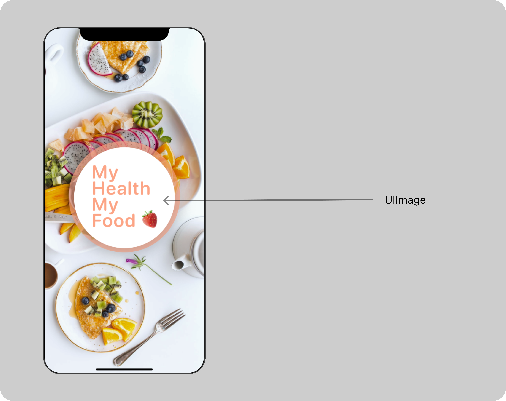
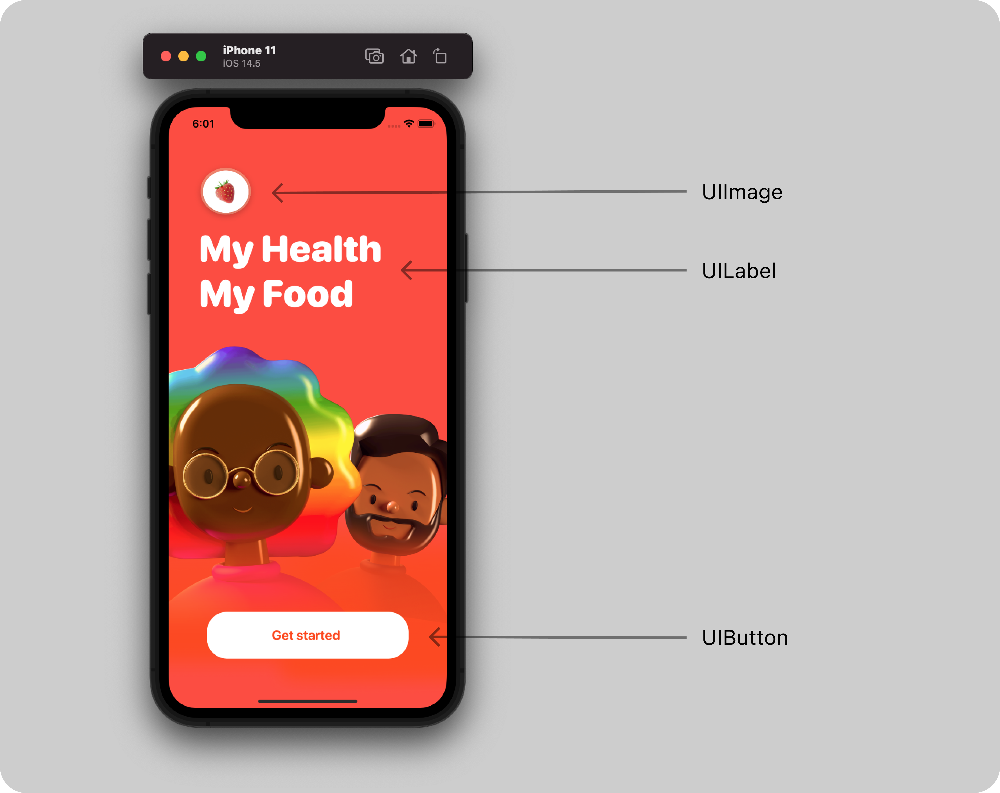

# MyHealthMyFood
iOS Application 📱for healthy food 🍎

##  Launch Screen

## Welcome Screen
This is the first screen user can have interaction with my app. You can see 3 different UI Components here: 
- `UIImage`
- `UIButton`
- `UILabel`

I have added custom font `SF-Pro-Rounded`. You can check  this link **[Adding a custom font to your app](https://developer.apple.com/documentation/uikit/text_display_and_fonts/adding_a_custom_font_to_your_app)** for implementation in Xcode project.
