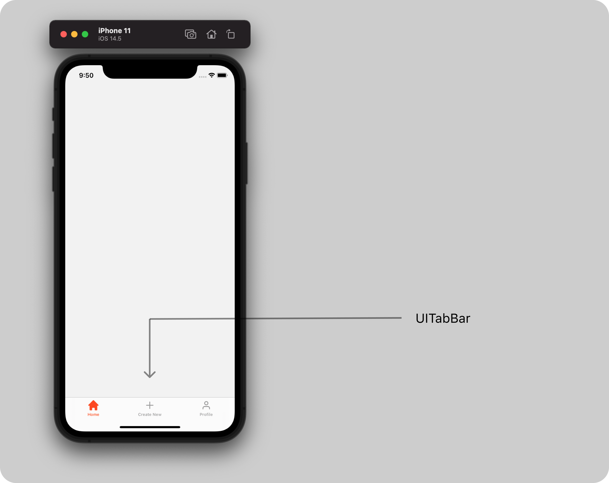
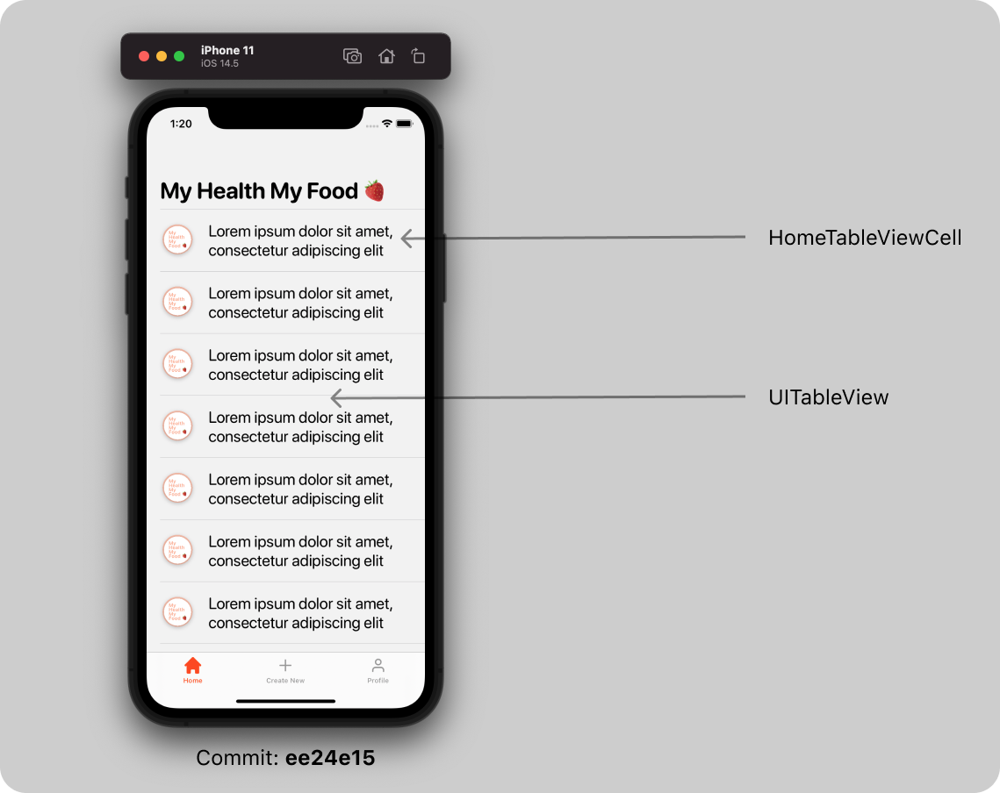
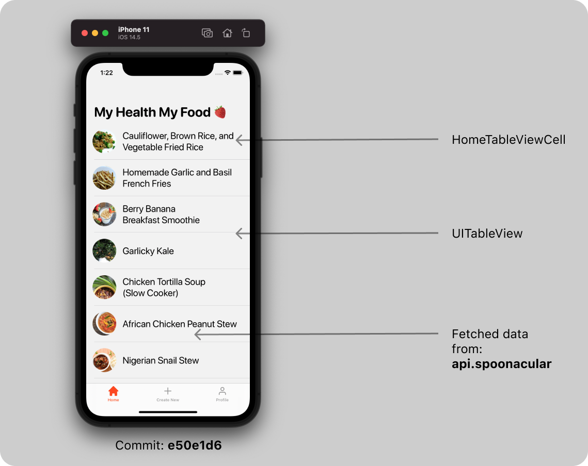

# MyHealthMyFood

# Intro
My Health My Food, is a mobile application for iPhone devices, which aims to offer healthy eating experiences among users.
In it you can find a number of recipes for healthy eating. Some of them are already known recipes, and some created by the users themselves.
This application differs from the competition in its simplicity (what users want is a clear display of a particular recipe without spending time on unnecessary information in the application or clicking ads) and transparency in the control of recipes, where each user can place a recipe and to reach a large number of users.

---
# Design 
Design for this application is inspired by: **[Food app by Marvis](https://www.figma.com/community/file/893381127703378146)**
## Colors
This are the colors that are used in the project: 
-   `brand`- `#FF460A` 
-   `background`- `#F2F2F2`

## Fonts
I have added custom font `SF-Pro-Rounded`. You can check  this link **[Adding a custom font to your app](https://developer.apple.com/documentation/uikit/text_display_and_fonts/adding_a_custom_font_to_your_app)** for implementation in Xcode project.

---
# Development

##  Launch Screen


## Welcome Screen
This is the first screen user can have interaction with my app. You can see 3 different UI Components here: 
- `UIImage`
- `UIButton`
- `UILabel`


## Tab Bar 
When the user tap on "Get started" button in Welcome Screen, we will show the tab bar with 3 view controllers ( flows ). 
1. Home
2. Create New
3. Profile 



## Home Screen 
In Home Screen user can see recipes fetched from soonacular API. The data is shown in `UITableView` and the table view contains custom table view cell called `HomeTableViewCell`. 

> This data is for testing purposes to check if API is working correctly with the app and should be changed later.
The data is fetched from API through `HomeManager`'s `func fetchTestRecipe(with url: String)` method. 
`HomeViewController` is updated with the new data through `HomeManagerDelegate`.

**HomeManager.swift**
```swift
func fetchTestRecipe(with url: String) {
    guard let url = URL(string: url) else { return }
    let urlRequest = URLRequest(url: url)
    let task = URLSession.shared.dataTask(with: urlRequest) { data, urlResponse, error in
        guard let data = data else { return }
        let decoder = JSONDecoder()
        let results = try? decoder.decode(TestResults.self, from: data)
        self.delegate?.update(with: results?.results)
    }
    task.resume()
}
```

**HomeManagerDelegate**
```swift 
protocol HomeManagerDelegate {
    func update(with results: [TestRecipe]?)
}
```

**HomeViewController: HomeManagerDelegate**
```swift
override func viewWillAppear(_ animated: Bool) {
    super.viewWillAppear(animated)

    HomeManager.shared.delegate = self
    HomeManager.shared.fetchTestRecipe(with: API.URL.test)
}
...

// MARK: - HomeManagerDelegate -
func update(with results: [TestRecipe]?) {
    guard let results = results else { return }
    self.results = results
    DispatchQueue.main.async {
        self.tableView.reloadData()
    }
}
```
### Basic setup for table view 


### Table view with fetched data


